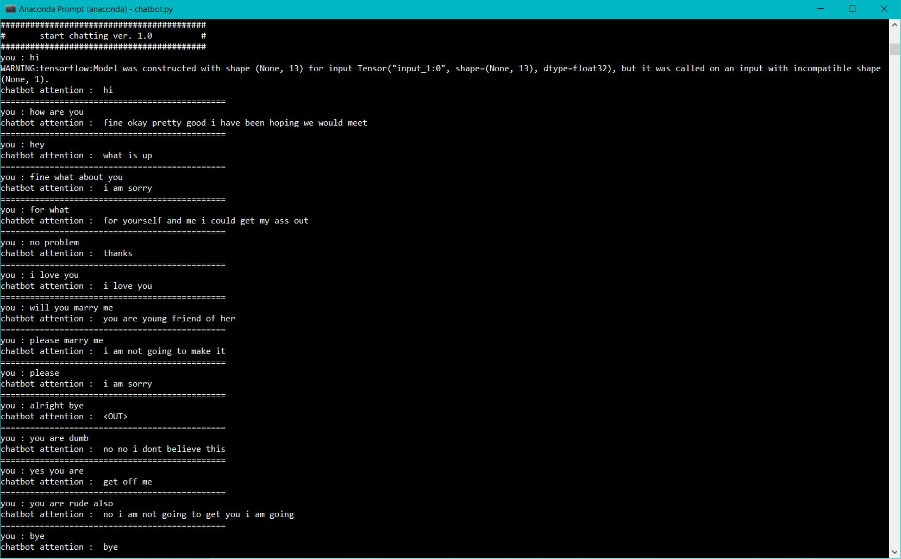

# keras-seq2seq-chatbot-with-attention
It is a seq2seq encoder decoder chatbot using keras and with attention

 <h1>files</h1>
<ol>
 <li>chatbot.py  :-  This is file to run <b>chatbot</b> using the saved model</li>
        <li>ipynb file  :-  This file is all in one you just need below datasets to run it Hopefully with no errors.
         it also saves the model in h5 format</li>
</ol>

<b>thanks to thushv89</b> https://github.com/thushv89/attention_keras for attention layer all credit for <b> Attention Layer</b> layer class goes him

<h1> How to RUN</h1>
<ol>
  <li>Run on kaggle : https://www.kaggle.com/programminghut/seq2seq-chatbot-keras-with-attention</li>
  <li>use chatbot.py once you ran ipynb file because save model is executed in above ipynb file</li>
</ol>

<h1> Datasets used : </h1>
<ol>
  <li>glove6b 50d : https://www.kaggle.com/watts2/glove6b50dtxt </li>
  <li>cornell movie :  https://www.cs.cornell.edu/~cristian/Cornell_Movie-Dialogs_Corpus.html </li>
</ol>

chatbot.py is the python file to run locally using the saved model.

<h1> Sample chat </h1>
  
  
  <i> if you still have queries you may contact me here </i>
  contact me :
  facebook : https://m.facebook.com/proogramminghub  
  twitter : https://twitter.com/programming_hut  
  github : https://github.com/Pawandeep-prog  
  discord : https://discord.gg/G5Cunyg  
  linkedin : https://www.linkedin.com/in/programminghut  
  youtube : https://www.youtube.com/c/programminghutofficial  
 
